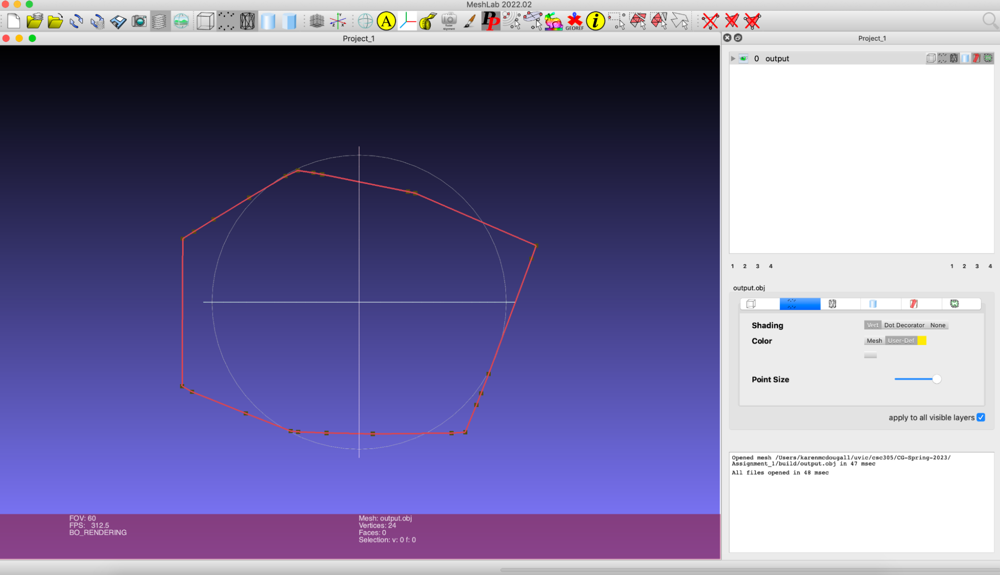
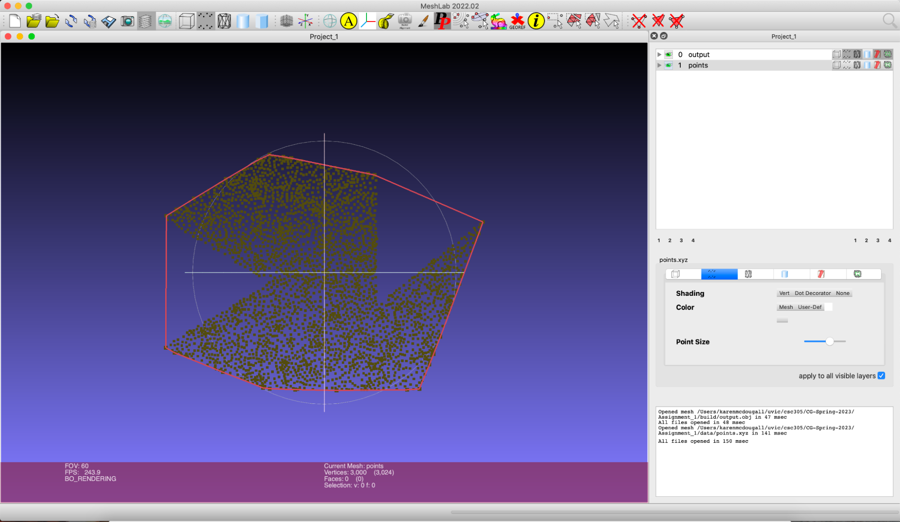
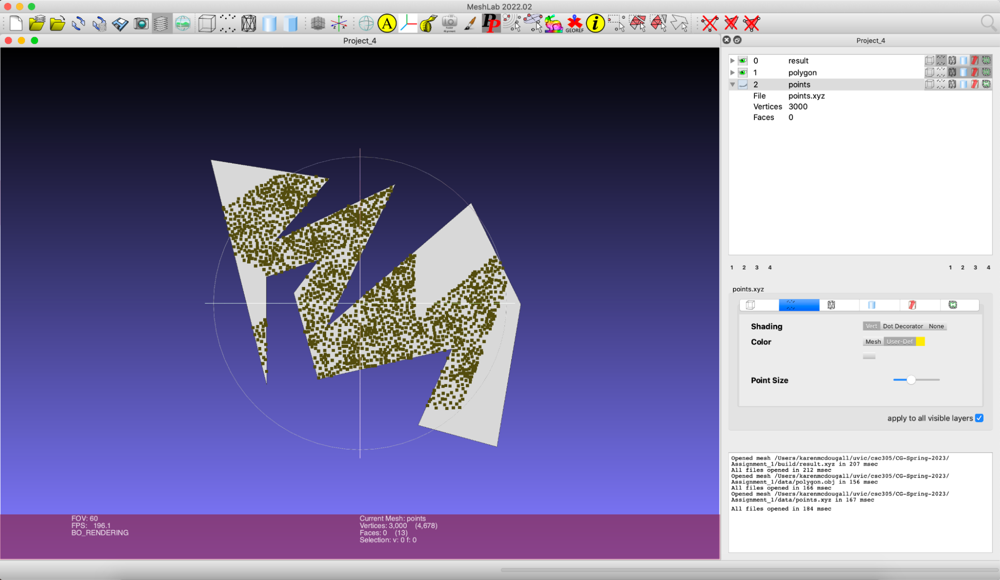
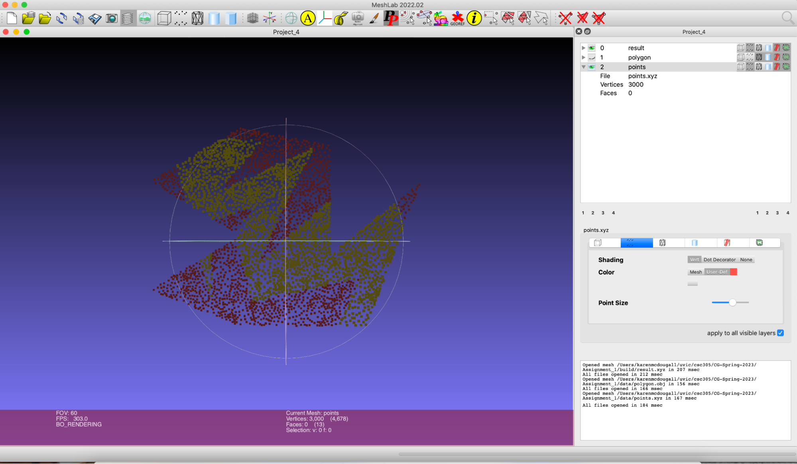

Convex Hull and Point in Polygon
======================================
## Process
**Convex Hull**

The convex_hull program takes a set of points in an .XYZ file as input, computes the convex hull around the set of points and outputs the vertices of the convex hull in an .OBJ file
- Implemented Graham's scan algoithm to find convex hull of set of 2D points
  - Sorted a vector of points in increasing order of angle between the lowest point and point of interest and x-axis
  - Checked angle between 3 points to see if it is a salient angle (less than 180 degrees)
  - Added current point of interest to hull if angle is salient, otherwise removed last point added to hull and iterated again with same point of interest
- Wrote final convex hull result to .OBJ file provided in command line

**Point in Polygon**

The point_in_polygon program takes a set of points in an .XYZ file and a polygon shape in an .OBJ file as input, computes which points lie within the polygon and outputs points within the polygon in an .XYZ file

- Implemented ray casting algorithm to determine if point is within polygon
  - Checked if point was within polygon by setting a point that is known to be outside the polygon
  - Checked if a vector from outside point to point of interest intersected with edge of polygon using signs of determinants
  - Determined if point was in polygon based on whether line intersected polygon an odd or even number of times

## How to run:

From convex-hull-point-in-polygon directory:

Convex hull
```
mkdir build; cd build; cmake ..; make
./convex_hull ../data/points.xyz output.obj
```

Point in Polygon
```
mkdir build; cd build; cmake ..; make
./point_in_polygon ../data/points.xyz ../data/polygon.obj result.xyz
```

## Results
Results are plotted using [meshlab](https://www.meshlab.net/)

The convex hull plotted:


The convex hull plotted with the point cloud it was calculated for


All the points in the polygon plotted ontop of the polygon shape


Points in the polygon are plotted in green, points outside of the polygon are plotted in red

