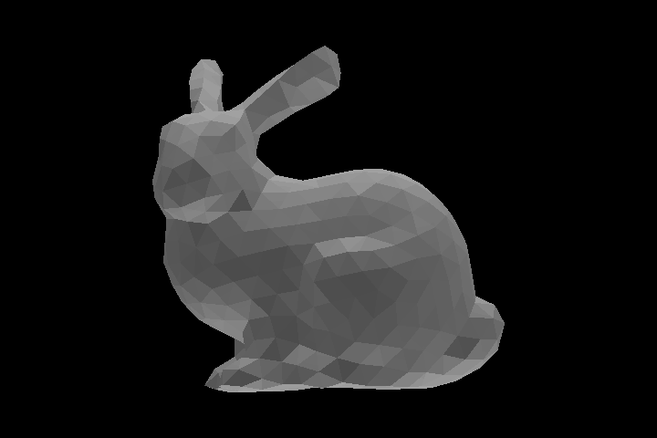

Rasterization
========================
## How to run:
```
mkdir build; cd build; cmake ..; make
./assignment5
```

## Result
Three of the resultant images are shown below, more images can be found in [/images/](./images) directory.

<div align="center">
    
  <p><i>Perspective view wireframe</i></p>
</div>

<div align="center">
    
  <p><i>Orthographic view with per-vertex shading</i></p>
</div>

<div align="center">
  
  <p><i>Orthographic view with per-vertex shading</i></p>
</div>
