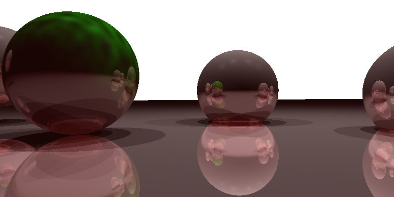

Basic Raytracing Effects
========================
## Process
This Project implements fundamental ray tracing effects, including shadows, reflection, refraction, and depth of field.

- Implemented ray-sphere and ray-parallelogram intersection functions based on the [previous assignment](./../raytracing-shading).

- Corrected the field of view size and implemented a perspective view:
  - Calculated the y value of the field of view using trigonometric identity and the known field of view angle and focal length.
  - Calculated the x value by multiplying the y value with the aspect ratio.
  - Set ray_origin to the camera position and ray_direction to the vector from the camera position to the pixel center.

- Added shading and shadow rays:
  - Implemented specular shading using the bisector between the view vector and light vector, and provided specular constant and exponent.
  - Implemented shadows using the is_light_visible() function to check for objects blocking the light source.
  - Skipped coloring and shading steps if the light is not visible.

- Implemented ideal reflection:
  - Calculated the reflected ray using the normal of the point of interest and the view vector.
  - Recursively called the shoot_ray() function with the reflected ray and decremented max_bounce value.
  - Checked the max_bounce value to avoid infinite recursion.

- Implemented Perlin noise:
  - Provided a grid of random gradient vectors.
  - Implemented linear interpolation and later cubic interpolation in the lerp() function.
  - Implemented the dotGridGradient() function to compute the dot product of the distance between two points and the gradient vectors.
  - Set x0 and y0 in the perlin() function to x and y.


## How to run:
```
mkdir build; cd build; cmake ..; make
./assignment3
```

## Results
<div align="center">
    
  <p><i>Resultant image. Left sphere coloured with Perlin Noise generated pattern. </i></p>
</div>
