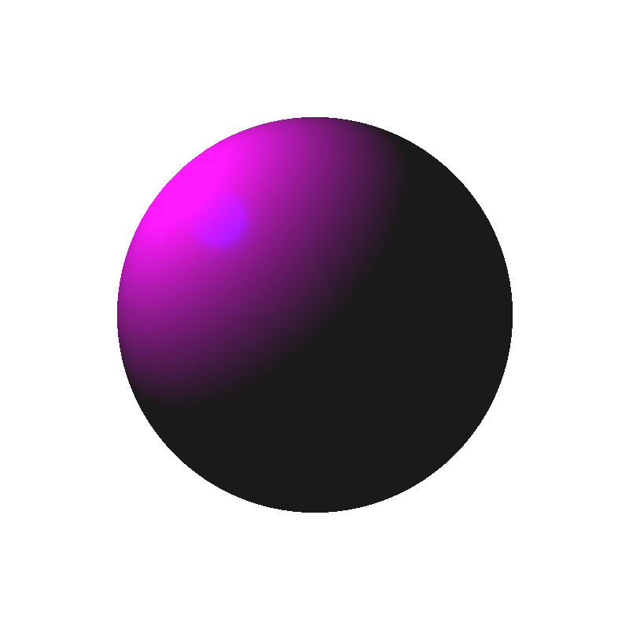

Raytracing and Shading
======================================
## Process
This project uses raytracing to render spheres and parallelograms for both orthogonal and perspective views. Lambertian and Blinn-Phong shading is implemented to add diffusion and specular shading to the image

**Parallelogram Raytracing**
- Created a function to calculate t, beta, and gamma based on given parameters of the parallelogram.
<div align="center">
    
  <p><i>Equation used to find intersection of ray and parallelogram</i></p>
</div>

- Used Cramer's rule to solve a 3 by 3 linear system for t, beta, and gamma.
- Calculated the intersection point by evaluating the ray equation at t.
- Determined the normal vector at the intersection point using the cross product of the parallelogram's vectors.
- Applied a diffusion model and saved the result as a PNG file.

Modified the parallelogram ray trace to use perspective projection:
- Changed the values of ray_origin and ray_direction.
- Ray_origin became the camera point, and ray_direction became the direction from the camera to the current pixel point.
- All other calculations remained the same as in orthographic projection.

**Sphere Raytracing**
- Calculated the ray-sphere intersection using the sphere equation.
<div align="center">
    
  <p><i>Equation used to find intersection of ray and sphere</i></p>
</div>

- Rearranged the equation to form a quadratic equation and used the quadratic formula to solve for t.
<div align="center">
    
  <p><i>Rearranged equation</i></p>
</div>

- Checked the discriminant of the quadratic equation to determine if the ray and sphere intersect.
- If the discriminant is non-negative, calculated the value of t using the quadratic formula.
- Found the intersection point by plugging the calculated t into the ray equation.

**Shading**
- Created separate channels for red, green, and blue color components to generate a colored image.
- Implemented diffusion shading using the Lambertian shading equation, which calculates the diffuse reflection.
- Applied specular shading using the Blinn-Phong shading equation, which calculates the specular reflection.
- Combined the results of each shading equation for each color component (red, green, and blue) to obtain the final shading equation.
<div align="center">
    
  <p><i>Shading equation</i></p>
</div>

## How to run:

```
mkdir build; cd build; cmake ..; make
./assignment2
```

## Results

Output of raytrace_parallelogram() function; a parallelogram with orthographic projection:


Output of raytrace_perspective() function; a parallelogram with perspective projection:


Output of raytrace_sphere() function; a sphere with orthographic projection:


Output of raytrace_shading() function; a sphere with perspective projection and ambient, diffusion & specular shading:

